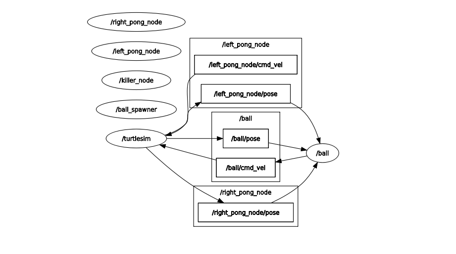

# turtlesim-pingpong

Simple project with turtle simulator, using ros2 nodes, topics, services, parameters and launch files. The `left-turtle` and `right_turtle` (multiplayer) tries to prevent the `ball_turtle` from htting the left and right walls.

### demo & rqt_graph

<div style="text-align: center;">
    
    
</div>


## Setup Locally ?

### Pre-requisite

> 1. Ubuntu 22.04 LTS
> 2. ROS2-Humble installed

#### Follow the steps

1. Clone the repository.

```bash
git clone "https://github.com/lonebots/turtlesim-pingpong.git"
```

2. Navigate to source folder.
```bash
cd turtlesim-pingpong/
```

3. Install the required packages 
```bash
chmod +x ./install.sh && sh ./install.sh
```

4. build the packages.

```bash
colcon build 
```

5. run the **launch** file.

```bash
ros2 launch turtlesim_pingpong turtlesim_pingpong.launch.py 
```


## Contribution

Please follow guidelines provided [here](./CONTRIBUTING.md).

---

<p align="center">Made with ❤️</p>